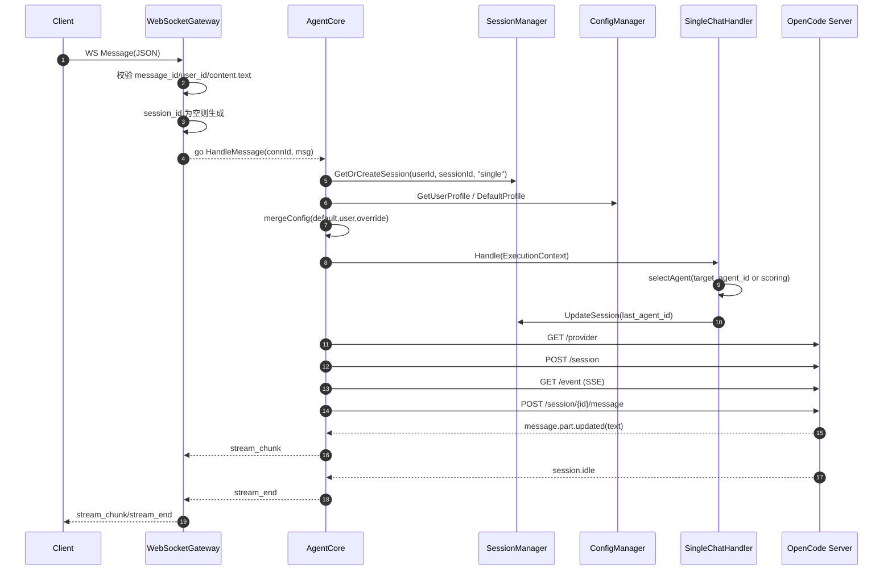
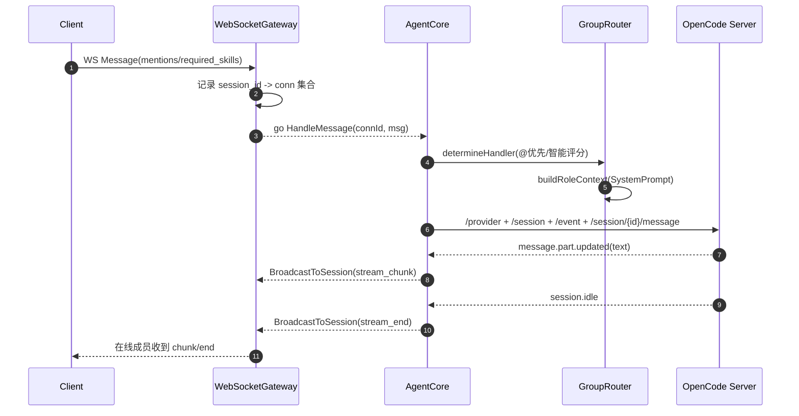

# agentServer

本工程是一个 DeepAgent 风格的 Agent 网关与调度核心，提供 WebSocket 接入、单聊/群聊路由、与 OpenCode server 的交互适配、日志持久化与实时/批量返回能力。

## 目标与边界

- 对外：提供 WebSocket 接入点 `/ws`，接收统一 Message 协议并返回 `stream_chunk/stream_end/error`
- 对内：通过 AgentCore 编排 Session/UserProfile/配置合并/路由/执行/回包/日志
- 对下游：适配 OpenCode server（按 `opencode/verify_routing.sh` 的 session/event 通信模式）
- 可插拔：agents、默认配置、心跳参数、日志目录均由外部配置控制

## 目录结构（当前工程）

```text
agentServer/
├── config/
│   └── config.json
├── internal/
│   ├── agentcore/
│   │   ├── agent_core.go
│   │   ├── session_manager.go
│   │   ├── config_manager.go
│   │   ├── message_router.go
│   │   ├── single_chat.go
│   │   ├── group_router.go
│   │   ├── subagent.go
│   │   ├── context.go
│   │   └── log_persistence.go
│   ├── config/
│   │   └── config.go
│   ├── opencode/
│   │   └── client.go
│   ├── protocol/
│   │   └── messages.go
│   └── ws/
│       └── gateway.go
├── main.go
├── start.sh
├── verify_ws.sh
└── ws_test.go
```

关键实现入口：
- WebSocket 网关：[gateway.go](file:///Users/jack/Desktop/agent/AgentFlow/backend/agentServer/internal/ws/gateway.go)
- AgentCore 编排：[agent_core.go](file:///Users/jack/Desktop/agent/AgentFlow/backend/agentServer/internal/agentcore/agent_core.go)
- OpenCode 适配：[client.go](file:///Users/jack/Desktop/agent/AgentFlow/backend/agentServer/internal/opencode/client.go)
- 消息协议：[messages.go](file:///Users/jack/Desktop/agent/AgentFlow/backend/agentServer/internal/protocol/messages.go)

## 外部配置

- 默认配置文件：`agentServer/config/config.json`
- 可通过环境变量覆盖路径：`WS_SERVER_CONFIG=/abs/path/to/config.json`

主要配置项：
- `server.port`：服务端口（默认 3002）
- `backend.models_api_url`：Go 后端模型列表接口（DuckDB 记录）
- `opencode.base_url`：OpenCode server 基地址
- `agents[]`：SubAgent 配置（capabilities / execution_config / health）
- `default_user_config`：默认用户交互配置（stream_mode / return_strategy / timeout）
- `websocket`：心跳与队列配置
- `log.dir`：日志目录

加载逻辑见：[config.go](file:///Users/jack/Desktop/agent/AgentFlow/backend/agentServer/internal/config/config.go)

## 消息协议

### 客户端 -> 服务端（Message）

必填字段：
- `message_id`
- `user_id`
- `content.text`

可选字段：
- `session_id`：为空则由网关生成
- `content.mentions`：群聊 @ 列表（用户ID）
- `metadata.target_agent_id`：指定 SubAgent
- `metadata.model_id`：指定 DuckDB 模型记录（用于 OpenCode 选择 provider/model）
- `metadata.override_config`：消息级覆盖配置（优先级最高）

结构定义：[Message](file:///Users/jack/Desktop/agent/AgentFlow/backend/agentServer/internal/protocol/messages.go)

### 服务端 -> 客户端（ServerMessage）

类型：
- `stream_chunk`：流式块
- `stream_end`：流结束（携带完整内容）
- `error`：错误

结构定义：[ServerMessage](file:///Users/jack/Desktop/agent/AgentFlow/backend/agentServer/internal/protocol/messages.go)

## 模块设计与职责

### 1) WebSocketGateway（连接管理/心跳/解析/投递/广播）

对应设计要点：
- 连接表：`map[connId]*Conn`（RWMutex 保护）
- 每连接读写分离：
  - readLoop：ReadMessage → Unmarshal → 校验 → 补齐 session_id → 异步投递 AgentCore
  - writeLoop：从 sendChan 单写协程 WriteJSON（避免并发写）
- 心跳检测：
  - 定时 ping
  - readDeadline + 最近活跃时间
  - 超过 pongWait 未活跃清理连接
- 群聊广播索引：
  - `sessions: map[sessionId]set(connId)`
  - 连接第一次发送消息时，把自己加入该 session
  - 对 group session，AgentCore 会调用网关广播输出

实现：[gateway.go](file:///Users/jack/Desktop/agent/AgentFlow/backend/agentServer/internal/ws/gateway.go)

### 2) AgentCore（主控模块）

职责：中央调度器，编排所有子模块。

主入口 `HandleMessage(connId, msg)` 对齐流程：
1. 获取/创建会话：`SessionManager.GetOrCreateSession(userId, sessionId, msgType)`
2. 获取用户配置：`ConfigManager.GetUserProfile(userId)`，不存在则 `GetDefaultProfile`
3. 合并配置：`default <- user <- message.override_config`
4. 构建 ExecutionContext：携带 Message/Session/UserProfile/EffectiveConfig/ConnectionID
5. 路由分发：
   - single → SingleChatHandler
   - group → GroupRouter
6. defer recover：panic → error 回包

实现：[agent_core.go](file:///Users/jack/Desktop/agent/AgentFlow/backend/agentServer/internal/agentcore/agent_core.go)

### 3) SessionManager（会话管理）

当前实现为内存版，行为与设计的 Redis 版对齐：
- Key 语义：`session:{sessionId}`
- TTL：24h（ExpiresAt=now+86400）
- sessionId 存在时：校验 userId，更新 UpdatedAt
- sessionId 不存在时：创建 Session（single/group）

实现：[session_manager.go](file:///Users/jack/Desktop/agent/AgentFlow/backend/agentServer/internal/agentcore/session_manager.go)

### 4) ConfigManager（用户配置管理）

当前实现为内存版，行为与设计的 Redis 版对齐：
- Key 语义：`user_profile:{userId}`
- Get 不存在时：使用 default 创建
- 合并优先级：default <- user <- message.override_config

实现：[config_manager.go](file:///Users/jack/Desktop/agent/AgentFlow/backend/agentServer/internal/agentcore/config_manager.go) 和 [context.go](file:///Users/jack/Desktop/agent/AgentFlow/backend/agentServer/internal/agentcore/context.go)

### 5) SubAgentPool（SubAgent 管理）

- 从外部配置加载 agents 列表
- 支持 Get/GetAll/Default

实现：[pool.go](file:///Users/jack/Desktop/agent/AgentFlow/backend/agentServer/internal/agentcore/pool.go) 与 [subagent.go](file:///Users/jack/Desktop/agent/AgentFlow/backend/agentServer/internal/agentcore/subagent.go)

### 6) SingleChatHandler（单聊处理）

Agent 选择逻辑：
1. 若 `metadata.target_agent_id` 指定，优先使用
2. 否则对所有 agent 评分，排序选择最高分：
   - 技能匹配（40%）：capability.keywords 命中 * capability.priority
   - 连续性（30%）：session.last_agent_id 命中加分
   - 负载（20%）：currentLoad/maxCapacity
   - 延迟（10%）：avgLatencyMs
3. 更新 session.last_agent_id 并持久化（UpdateSession）

实现：[single_chat.go](file:///Users/jack/Desktop/agent/AgentFlow/backend/agentServer/internal/agentcore/single_chat.go)

### 7) GroupRouter（群聊路由）

处理者决策逻辑：
1. 明确 @mentions：优先第一个被 @ 且在线成员
2. 否则：分析 requiredSkills（metadata 或文本关键词）→ 候选筛选 → 多维评分
3. buildRoleContext：构建 RoleIdentity + SystemPrompt（让 OpenCode 以角色身份回答）
4. SubAgent 选择：优先 `metadata.target_agent_id`，否则 default
5. 回包方式：广播到 session 的在线连接

实现：[group_router.go](file:///Users/jack/Desktop/agent/AgentFlow/backend/agentServer/internal/agentcore/group_router.go)

### 8) LogPersistence（日记持久化）

目录结构：

```text
{log.dir}/
  └── {userId}/
      └── {sessionId}.log
```

日志格式：
- `[timestamp] [CHUNK] ...`
- `[timestamp] [THINKING] ...`
- `[timestamp] [FINAL] ...`
- `=== SESSION_END ... ===`

实现：[log_persistence.go](file:///Users/jack/Desktop/agent/AgentFlow/backend/agentServer/internal/agentcore/log_persistence.go)

## 与 OpenCode server 的通信方式与解析方式

当前实现采用 OpenCode server 的 session/event 模式（与 `opencode/verify_routing.sh` 对齐），而非 `/v1/chat/completions`：

1. `GET {baseURL}/provider`：获取 provider/model 清单与默认 model
2. `POST {baseURL}/session`：创建 session，返回 `sessionID`
3. `GET {baseURL}/event`：建立 SSE，监听事件流
4. `POST {baseURL}/session/{sessionID}/message`：发送消息
   - Header：`X-User-ID`（用户ID）、`X-Model-ID`（DuckDB 模型ID）
   - Body：包含 model(providerID/modelID)、variant(user_id)、parts(text)

SSE 事件解析：
- `message.part.updated`：取 `properties.part.text` → 转为 `stream_chunk.payload.content`
- `session.idle`：认为一次响应完成 → 发送 `stream_end`（携带累计内容）
- `session.error`：发送 `error`（payload: code/message/retryable）

实现：[opencode client](file:///Users/jack/Desktop/agent/AgentFlow/backend/agentServer/internal/opencode/client.go)

## 单聊/群聊消息传递流程图（Mermaid）

### 单聊（Single）



### 群聊（Group）



## 启动与验证

- 启动：`bash start.sh`
- 测试：`bash verify_ws.sh` 或 `go test ./...`

## 与 README 设计的差异说明（当前实现）

- SessionManager / ConfigManager 当前为内存实现（行为与 Redis 版对齐），可后续替换为 Redis 存储。
- OpenCode 交互采用 session/event 模式；如需兼容 `/v1/chat/completions`，可在 opencode adapter 中增加实现并通过配置切换。
