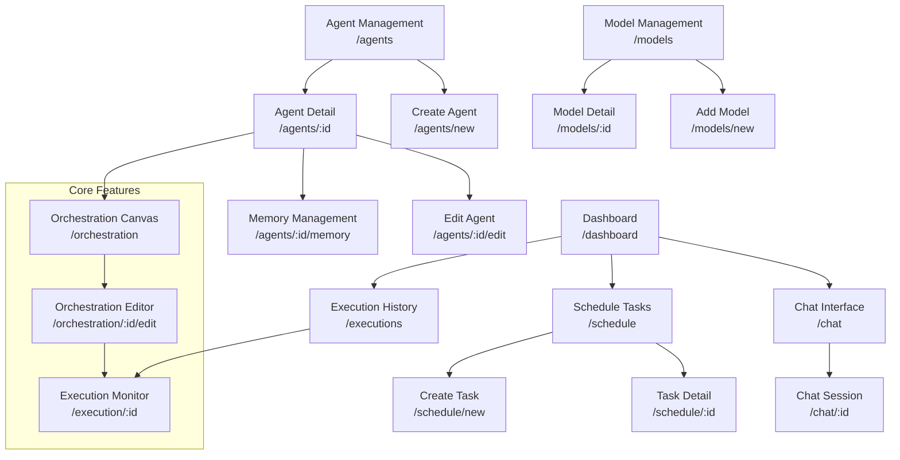

# User Flow — AgentFlow Platform

```mermaid
graph TD
  %% Primary Pages
  Dashboard["Dashboard<br/>/dashboard"]
  AgentManagement["Agent Management<br/>/agents"]
  ModelManagement["Model Management<br/>/models"]
  OrchestrationCanvas["Orchestration Canvas<br/>/orchestration"]

  %% Core Business Features - Agent Orchestration
  subgraph "Core Features"
    OrchestrationCanvas --> OrchestrationEditor["Orchestration Editor<br/>/orchestration/:id/edit"]
    OrchestrationEditor --> ExecutionMonitor["Execution Monitor<br/>/execution/:id"]
  end

  %% Agent Management Flow
  AgentManagement --> AgentDetail["Agent Detail<br/>/agents/:id"]
  AgentManagement --> AgentCreate["Create Agent<br/>/agents/new"]
  AgentDetail --> MemoryManagement["Memory Management<br/>/agents/:id/memory"]
  AgentDetail --> AgentEdit["Edit Agent<br/>/agents/:id/edit"]

  %% Model Management Flow
  ModelManagement --> ModelDetail["Model Detail<br/>/models/:id"]
  ModelManagement --> ModelCreate["Add Model<br/>/models/new"]

  %% Dashboard Connections
  Dashboard --> ScheduleTasks["Schedule Tasks<br/>/schedule"]
  ScheduleTasks --> TaskCreate["Create Task<br/>/schedule/new"]
  ScheduleTasks --> TaskDetail["Task Detail<br/>/schedule/:id"]

  %% Cross-feature Navigation
  Dashboard --> ExecutionHistory["Execution History<br/>/executions"]
  ExecutionHistory --> ExecutionMonitor

  AgentDetail --> OrchestrationCanvas

  Dashboard --> ChatInterface["Chat Interface<br/>/chat"]
  ChatInterface --> ChatSession["Chat Session<br/>/chat/:id"]
```
